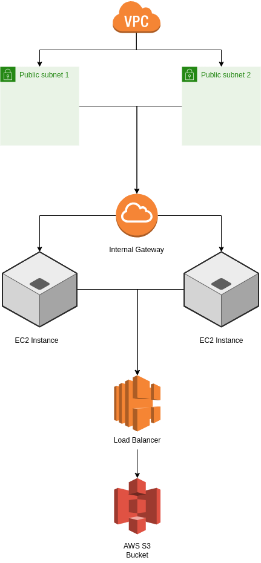

# CloudProvisioner
CloudProvisioner is a project that demonstrates advanced-level skills in deploying and managing cloud infrastructure using Amazon Web Services (AWS). The project focuses on provisioning virtual machines, setting up networking, configuring load balancers, and managing storage resources. By implementing this project, you will gain hands-on experience with real-world cloud infrastructure deployment and management scenarios.

## Table of Contents
- Project Objectives
- Technologies and Tools Used
- Architecture Design
- Project Implementation
- Project Deployment
- Contributing
- License

## Project Objectives
The primary objectives of this project are as follows:
- Provision virtual machines in the AWS environment.
- Set up networking components to establish communication between virtual machines.
- Configure a load balancer to distribute incoming traffic across multiple virtual machines.
- Manage storage resources to ensure efficient utilization and data redundancy.

## Technologies and Tools Used
- Amazon Web Services (AWS)
- AWS EC2 (Elastic Compute Cloud)
- Amazon VPC (Virtual Private Cloud)
- Elastic Load Balancer (ELB)
- Amazon S3 (Simple Storage Service)
- AWS CLI (Command Line Interface)

## Architecture Design
The project architecture consists of the following components: 
- AWS VPC
- Subnets
- Internet Gateway
- Security Groups
- Elastic Load Balancer (ELB)
- Virtual Machines (EC2 Instances)
- Amazon S3 Bucket

## Project Implementation
The implementation of the project includes the following steps:

1. Provisioning Virtual Machines
2. Networking Setup
3. Load Balancer Configuration
4. Storage Resource Management
For detailed instructions on implementing each step, please refer to the Project Implementation section in the project documentation.

## Project Deployment
To deploy the CloudProvisioner project, follow the steps outlined in the project implementation. Make sure you have the necessary AWS account and credentials set up. Detailed deployment instructions can be found in the project documentation.

## Contributing
Contributions are welcome! If you have any suggestions, ideas, or improvements for this project, please feel free to submit a pull request. We appreciate your contributions.

## License
This project is licensed under the MIT License. Feel free to use and modify the code according to your needs.
